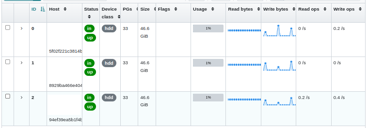

# Ceph Kubernetes

A repo-tutorial to learn how to install and use [Rook Ceph](https://rook.io) on a Kubernetes cluster (block storage).

## What

Ceph is an open-source software-defined storage solution which allows you to store data as object (through the Ceph Object Gateway - S3-compatible), block (Ceph RBD through OSDs) or file (CephFS).

Rook is a cloud-native storage orchestrator for Kubernetes while Ceph is a distributed storage system. Rook Ceph is the integration of Rook and Ceph, providing an easy-to-manage storage solution for Kubernetes.

What we will be doing :

1. Prepare a unformatted disk on each node
2. Install Rook Ceph on a 3-nodes pre-existant Kubernetes cluster (3 nodes required)
3. Deploy a file sharing app and upload 3 files
4. Stop the Kubernetes node on which our web service is deployed
5. See what happens ! (pod will be re-scheduled, but has the block storage lost data ?)

{Screenshot Rook}

## Why

Ceph allows you to get a fault-tolerant and replicated storage for your Kubernetes pods (replicated volumes).

Additionnaly, it avoids putting too much disk pressure on one single storage source. It makes you save money by lowering the cost of maintenance of your storage servers, as it is managed by Kubernetes (allows updates across the cluster, horizontal scaling on several smaller servers).

With Ceph, you have a [continuous scaling path, forward, forever](https://www.youtube.com/watch?v=yeAlzSp6yaE).

## Getting started

### A. Installing Rook Ceph

1. Create a 3-nodes Kubernetes cluster

    We recommend [Scaleway Kapsule](https://www.scaleway.com/en/kubernetes-kapsule) to easily instanciate a Kubernetes cluster with 3 nodes and attribute unformatted volumes.

    Once the Kubernetes cluster has started, we will create an attached volume (disk) for **each** node :

    - Go to "Instances"
    - Select your node
    - Click the "Attached volumes" tab
    - Click "+" (Create volume) and create a new disk

    The new disk should appear under `/dev/sdb` on each node.

2. Clone the Rook repo

    All raw disks will be used for our Ceph cluster.

    ```bash
    git clone --single-branch --branch release-1.11 https://github.com/rook/rook.git
    ```

3. Deploy Rook resources

    ```bash
    kubectl create -f ./rook/deploy/examples/crds.yaml
    kubectl create -f ./rook/deploy/examples/common.yaml
    kubectl create -f ./rook/deploy/examples/operator.yaml
    ```

    All components will be instanciated in the `rook-ceph` namespace.

    Check the status of the deployed operator and wait :

    ```bash
    kubectl get po -n rook-ceph
    ```

4. Create the Ceph cluster

    ```bash
    kubectl create -f ./rook/deploy/examples/cluster.yaml -n rook-ceph
    ```

    > :information_source: You can configure the exact device and nodes used to create the Ceph cluster from line 235 of the [cluster.yaml](./rook/deploy/examples/cluster.yaml#L235) file.

    Wait several minutes until the health is `HEALTH_OK` :

    ```bash
    kubectl get cephcluster -n rook-ceph
    ```

5. Deploy the toolbox and check the cluster status

    The Ceph Toolbox can be used to perform actions on the Ceph cluster through its CLI.

    ```bash
    kubectl create -f ./rook/deploy/examples/toolbox.yaml -n rook-ceph
    ```

    Enter the toolbox pod :

    ```bash
    kubectl -n rook-ceph exec -it deploy/rook-ceph-tools -- bash
    ```

    Then check Ceph's status. Each host's state should be `exists,up` :

    ```bash
    ceph osd status
    ```

6. Create an RBD

    RBD stands for _RADOS Block Device_ and allows you to have a storage class to provision volumes in your Kubernetes cluster.

    :information_source: The storage class name is `rook-ceph-block`

    ```bash
    kubectl create -f ./rook/deploy/examples/csi/rbd/storageclass.yaml -n rook-ceph
    ```

    To check that a volume correctly bind to the `rook-ceph-block` storage class :

    ```bash
    kubectl create -f ./rook/deploy/examples/csi/rbd/pvc.yaml -n rook-ceph
    kubectl get pvc rbd-pvc -n rook-ceph # status should be "BOUND"
    ```

7. Deploy Ceph's dashboard

    ```bash
    kubectl create -f ./rook/deploy/examples/dashboard-external-https.yaml -n rook-ceph
    ```

    Forward dashboard's access :

    ```bash
    kubectl port-forward service/rook-ceph-mgr-dashboard -n rook-ceph 8443:8443
    ```

    Connect with the username `admin` and following password :

    ```bash
    kubectl -n rook-ceph get secret rook-ceph-dashboard-password -o jsonpath="{['data']['password']}" | base64 --decode
    ```

### B. Deploying our app

Let's now deploy [psitransfer](https://github.com/psi-4ward/psitransfer) !

1. Deploy the file sharing app

    ```bash
    kubectl create -f ./psitransfer-deployment.yaml
    ```

    See on which node it is deployed :

    ```bash
    kubectl get pods -o wide -l app=psitransfer
    ```

    Retrieve the IP of this node (through the Scaleway interface) and check the app is running at _http://nodeip:30080_

2. Let's upload some files

    Download the [5MB](http://212.183.159.230/5MB.zip), [10MB](http://212.183.159.230/10MB.zip) and [20MB](http://212.183.159.230/20MB.zip) files from [xcal1.vodafone.co.uk website](http://xcal1.vodafone.co.uk/).

    Upload them to our file transfer app. Click the link that appears on screen.

    You should now see the tree files imported.

After uploading around 400MB of files, we can prove the replication of data is coherent accross disks. We see that the 3 disks are written simultaneously while we upload a file. Usage is 1% for each disk : although I uploaded on the same host, it seems the replication is working as expected with data equally persisted across the 3 disks (OSDs).



### C. Destroy and see !

We're going to destroy the node hosting the web app to make sure data was replicated on the other nodes.

1. See on which node the app is deployed :

    ```bash
    kubectl get pods -o wide -l app=psitransfer
    ```

2. Shutdown the node from the Scaleway console
