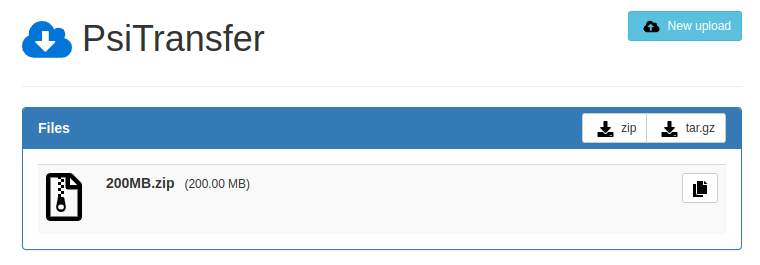

# Ceph Kubernetes

A repo-tutorial to learn how to install and use [Rook Ceph](https://rook.io) on a Kubernetes cluster.

- 👉 Get a safe & replicated storage
- 👉 Enjoy a _ReadWriteMany_ storage class
- 👉 Scale storage horizontally and safely

Read the [associated blog post on Medium](https://medium.com/@flavienb/infinitely-scalable-storage-for-kubernetes-9a20393e37e4) !

## What

Ceph is an open-source software-defined storage solution which allows you to store data as object (through the Ceph Object Gateway - S3-compatible), block (Ceph RBD) or file (CephFS).

Rook is a cloud-native storage orchestrator for Kubernetes while Ceph is a distributed storage system. Rook Ceph is the integration of Rook and Ceph, providing an easy-to-manage storage solution for Kubernetes.

What we will be doing :

1. Prepare a unformatted disk on each node
2. Install Rook Ceph on a 3-nodes pre-existant Kubernetes cluster (3 nodes required)
3. Deploy a file sharing app and upload some files
4. Stop the Kubernetes node on which our web service is deployed
5. See what happens ! (pod will be re-scheduled upon removal, but has the block storage lost data ?)


## Why

Ceph allows you to get a fault-tolerant and replicated storage for your Kubernetes pods (replicated volumes).

Additionnaly, it avoids putting too much disk pressure on one single storage source. It makes you save money by lowering the cost of maintenance of your storage servers, as it is managed by Kubernetes (allows updates across the cluster, horizontal scaling on several smaller servers).

With Ceph, you have a [continuous scaling path, forward, forever](https://www.youtube.com/watch?v=yeAlzSp6yaE).

Remind that most of the time, a natively distributed system such as an Elasticsearch cluster has its nodes each using an individual PVC. Elasticsearch then natively manages data replication across its nodes. Ceph can still be useful to avoid the loss of the underlying data used by nodes. This is a kind of double security for your data. Ceph is the most useful when it comes to non-native distributed systems such as a simple PostgreSQL database or backups data.

## Getting started

### A. Installing Rook Ceph

1. Create a 3-nodes Kubernetes cluster

    We recommend [Scaleway Kapsule](https://www.scaleway.com/en/kubernetes-kapsule) to easily instantiate a Kubernetes cluster with 3 nodes and attribute unformatted volumes.

    Once the Kubernetes cluster has started, we will create an attached volume (disk) for **each** node :

    - Go to "Instances"
    - Select your node
    - Click the "Attached volumes" tab
    - Click "+" (Create volume) and create a new disk

    The new disk should appear under `/dev/sdb` on each node.

    All raw disks will be used for our Ceph cluster.

2. Clone the Rook repo

    ```bash
    git clone --single-branch --branch release-1.11 https://github.com/rook/rook.git
    ```

3. Deploy Rook resources

    ```bash
    kubectl create -f ./rook/deploy/examples/crds.yaml
    kubectl create -f ./rook/deploy/examples/common.yaml
    kubectl create -f ./rook/deploy/examples/operator.yaml
    ```

    All components will be instanciated in the `rook-ceph` namespace.

    Check the status of the deployed operator and wait :

    ```bash
    kubectl get po -n rook-ceph
    ```

4. Create the Ceph cluster

    ```bash
    kubectl create -f ./rook/deploy/examples/cluster.yaml -n rook-ceph
    ```

    > :information_source: You can configure the exact device and nodes used to create the Ceph cluster from line 235 of the [cluster.yaml](./rook/deploy/examples/cluster.yaml#L235) file.

    Wait several minutes until the health is `HEALTH_OK` :

    ```bash
    kubectl get cephcluster -n rook-ceph
    ```

5. Deploy the toolbox and check the cluster status

    The Ceph Toolbox can be used to perform actions on the Ceph cluster through its CLI.

    ```bash
    kubectl create -f ./rook/deploy/examples/toolbox.yaml -n rook-ceph
    ```

    Enter the toolbox pod :

    ```bash
    kubectl -n rook-ceph exec -it deploy/rook-ceph-tools -- bash
    ```

    Then check Ceph's status. Each host's state should be `exists,up` :

    ```bash
    ceph osd status
    ```

6. Create the RBD storage class

    RBD stands for _RADOS Block Device_ and allows you to have a storage class to provision volumes in your Kubernetes cluster. This only supports `ReadWriteOnce` volumes (RWO). See step 7 for `ReadWriteMany` capabilities.

    :information_source: RBD's storage class name is `rook-ceph-block`

    ```bash
    kubectl create -f ./rook/deploy/examples/csi/rbd/storageclass.yaml -n rook-ceph
    ```

    To check that a volume correctly bind to the `rook-ceph-block` storage class :

    ```bash
    kubectl create -f ./rook/deploy/examples/csi/rbd/pvc.yaml -n rook-ceph
    kubectl get pvc rbd-pvc -n rook-ceph # status should be "BOUND"
    ```

7. Create the CephFS storage class

    CephFS acts like a replicated NFS server. This is what will allow us to create volumes in `ReadWriteMany` mode (RWX).

    :information_source: CephFS' storage class name is `rook-cephfs`

    ```bash
    kubectl create -f ./rook/deploy/examples/filesystem.yaml -n rook-ceph
    kubectl create -f ./rook/deploy/examples/csi/cephfs/storageclass.yaml -n rook-ceph
    ```

    To check that a volume correctly bind to the `rook-cephfs` storage class :

    ```bash
    kubectl create -f ./rook/deploy/examples/csi/cephfs/pvc.yaml -n rook-ceph
    kubectl get pvc cephfs-pvc -n rook-ceph # status should be "BOUND"
    ```

8. Deploy Ceph's dashboard

    ```bash
    kubectl create -f ./rook/deploy/examples/dashboard-external-https.yaml -n rook-ceph
    ```

    Forward dashboard's access :

    ```bash
    kubectl port-forward service/rook-ceph-mgr-dashboard -n rook-ceph 8443:8443
    ```

    Connect with the username `admin` and following password :

    ```bash
    kubectl -n rook-ceph get secret rook-ceph-dashboard-password -o jsonpath="{['data']['password']}" | base64 --decode
    ```

### B. Deploying our app

Let's now deploy [psitransfer](https://github.com/psi-4ward/psitransfer) !

1. Deploy the file sharing app

    ```bash
    kubectl create -f ./psitransfer-deployment-rwx.yaml
    ```

    See on which node it is deployed :

    ```bash
    kubectl get pods -o wide -l app=psitransfer
    ```

    Retrieve the IP of this node (through the Scaleway interface) and check the app is running at _http://nodeip:30080_

2. Let's upload some files

    Download the [5MB](http://212.183.159.230/5MB.zip), [10MB](http://212.183.159.230/10MB.zip) and [20MB](http://212.183.159.230/20MB.zip) files from [xcal1.vodafone.co.uk website](http://xcal1.vodafone.co.uk/).

    Upload them to our file transfer app. Click the link that appears on screen.

    You should now see the tree files imported. Click on it and **keep the link in your browser tab**, we'll use it later.

After uploading around 400MB of files, we can prove the replication of data is coherent across disks. We see that the 3 disks are written simultaneously while we upload files. In the following screenshot, usage is 1% for each disk : although I uploaded on the same host, it seems the replication is working as expected with data equally persisted across the 3 disks (OSDs). Disk 2 has a lot of "read" activity as the 2 other disks synchronize data from it.


This is how Ceph's dashboard should look like :


### C. Destroy and see

We're going to stop the node hosting the web app to make sure data was replicated on the other nodes.

1. See on which node the app is deployed :

    ```bash
    kubectl get pods -o wide -l app=psitransfer
    ```

2. Poweroff the node from the Scaleway console

    This simulates a power failure on a node. It should become `NotReady` after several minutes :

    ```bash
    $> kubectl get node
    NAME                                             STATUS     ROLES    AGE    VERSION
    scw-ceph-test-clustr-default-5f02f221c3814b47a   Ready      <none>   3d1h   v1.26.2
    scw-ceph-test-clustr-default-8929ba466e404a00a   Ready      <none>   3d1h   v1.26.2
    scw-ceph-test-clustr-default-94ef39ea5b1f4b3e8   NotReady   <none>   3d1h   v1.26.2
    ```

    And Node 3 is unavailable on our Ceph dashboard :

    

    Ceph's dashboard should look like this :

    

3. Reschedule our pod

    Scheduled pod node is unavailable. However, our pod still thinks it is active :

    ```bash
    $> kubectl get pods -o wide -l app=psitransfer
    NAME                                      READY   STATUS    RESTARTS   AGE   IP            NODE
    psitransfer-deployment-8448887c9d-mt6wm   1/1     Running   0          19h   100.64.1.19   scw-ceph-test-clustr-default-94ef39ea5b1f4b3e8
    ```

    Delete it to reschedule it on another node :

    ```bash
    kubectl delete pod psitransfer-deployment-8448887c9d-mt6wm 
    ```

    Check the status of the newly-restarted pod. Your app should be available again at the link previously kept.

    

    :information_source: To avoid having to manually delete the pod to be rescheduled when a node gets "NotReady", scale the number of replicas of your app to at least 3 by default.

    You can now restart the previously powered-off node.

### When to use **rook-ceph-block** or **rook-cephfs** ?

If your applications need better performance and require block storage with RWO access mode, use the rook-ceph-block (RBD) storage class. On the other hand, if your applications need a shared file system with RWX (CephFS) access mode and POSIX compliance, use the rook-cephfs storage class.

If choosing RBD and trying to reschedule a pod while its original node is offline as we did with CephFS, you will get an error from the PVC stating : "_Volume is already exclusively attached to one node and can't be attached to another_". In that case, you just need to wait for the PVC to bind back (it took me ~6 minutes for the cluster to automatically re-attribute the PVC to my pod, allowing it to start).

Try this behavior following this procedure :

1. Running RBD's deployment example

    ```bash
    kubectl create -f ./psitransfer-deployment-rwo.yaml
    ```

2. Shutting down the instance on which the pod is scheduled

    ```bash
    kubectl get pods -o wide -l app=psitransfer-rwo
    ```

    Cordon the node to make sure nothing will be re-scheduled on it :

    ```bash
    kubectl cordon scw-ceph-test-clustr-default-94ef39ea5b1f4b3e8
    ```

3. Deleting the pod for it to be reschedule (and wait ~6 minutes for PVC to bind)

    ```bash
    kubectl delete pod --grace-period=0 --force psitransfer-deployment-8448887c9d-mt6wm 
    ```

You should be able to still access data uploaded previously on the app.
